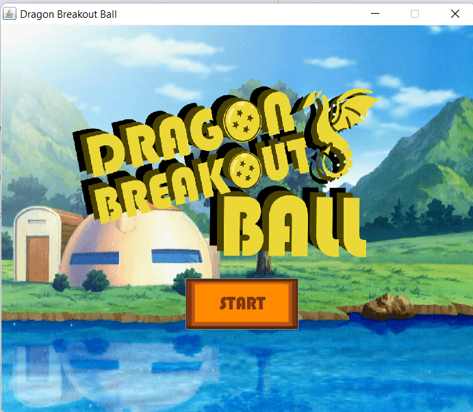
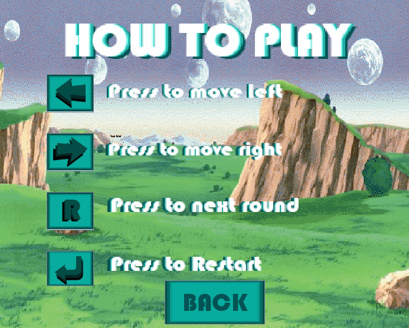
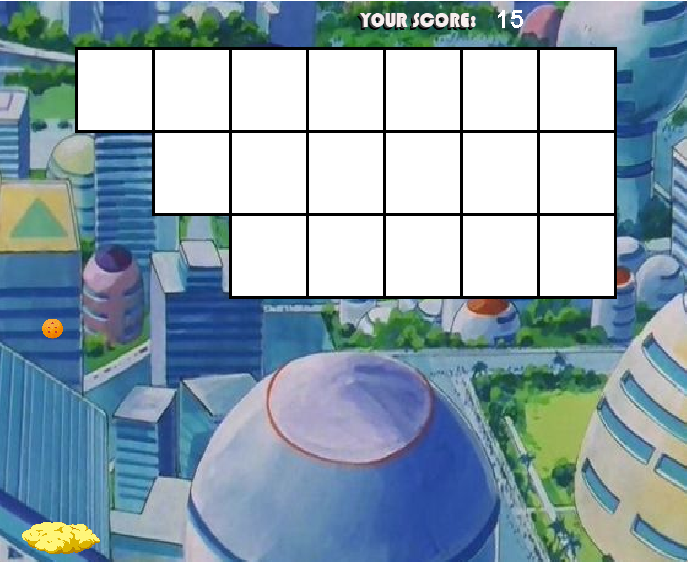
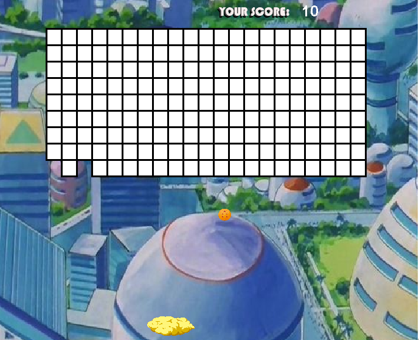

# 🐉 Dragon Breakout Ball (2022)



> A Java-based breakout-style arcade game where you shoot balls to break blocks and earn points — fast-paced, strategic, and fun.

---

## 🎮 Game Overview

Dragon Breakout Ball is a 2D arcade-style game inspired by the classic brick-breaker genre.  
You control a paddle that launches energy balls to break through colorful blocks.  
With each level, the challenge increases — more speed, more chaos, more fun!

- 🧱 Break the blocks
- 🏆 Score as high as you can
- 💥 Watch out for power-ups and power-downs
- 🐲 Fight through dragon-themed levels

---

## 🖼️ Screenshots

| Gameplay | How to Play | Easy Mode | Hard Mode |
|---------|-------------|------------|-----------|
|  |  |  |  |

---

## ⚙️ Technologies Used

- **Language**: Java
- **Graphics**: Java Swing / Java AWT
- **Development Tool**: NetBeans / Eclipse (optional)
- **Assets**: Custom-designed sprites and blocks

---


---

## 🚀 How to Run the Game

### ✅ Requirements

- Java JDK 11+  
  (แนะนำ [OpenJDK 21 LTS](https://jdk.java.net/21/))
- VS Code + [Java Extension Pack](https://marketplace.visualstudio.com/items?itemName=vscjava.vscode-java-pack) (ถ้ารันผ่าน VS Code)

---

### ▶ Run via Terminal (No IDE required)

1. **เปิด Terminal แล้วเข้าโฟลเดอร์** `src`:

    ```bash
    cd src
    ```

2. **Compile all Java files:**

    ```bash
    javac finalproject1/*.java
    ```

3. **Run the game:**

    ```bash
    java finalproject1.Main
    ```

---

### 💡 Tips

- ถ้าไฟล์ภาพไม่แสดง → ตรวจสอบว่า `assets/` อยู่ใน root เดียวกับที่รันโปรแกรม
- รันผ่าน VS Code ได้ถ้าติดตั้ง `Java Extension Pack` แล้วกดปุ่ม ▶ ที่ `Main.java`

---

## 📁 Project Structure

